# Simulation Performance

The project provides an introduction to simulation performance and modelling. Confidential information is not displayed.Custom images created by Alpa D. Desai.

## Sales

## Profit Margins
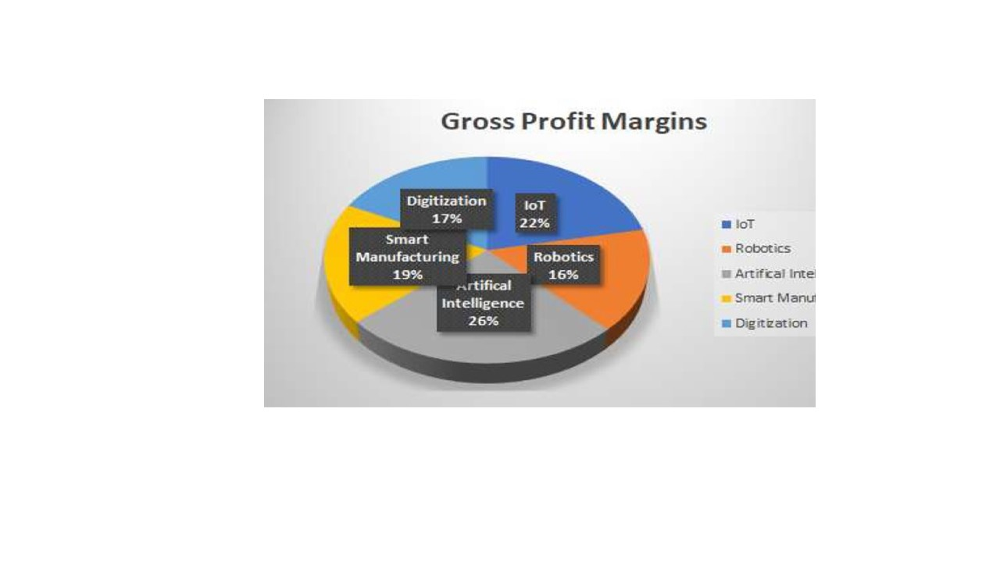

## Revenue Streams
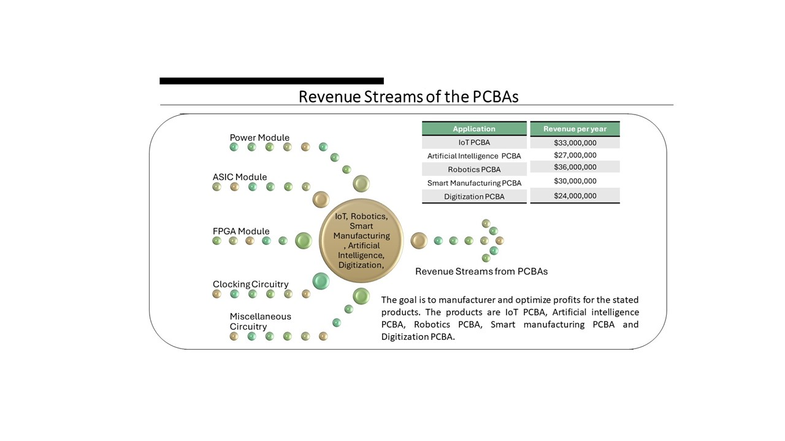

## Product 
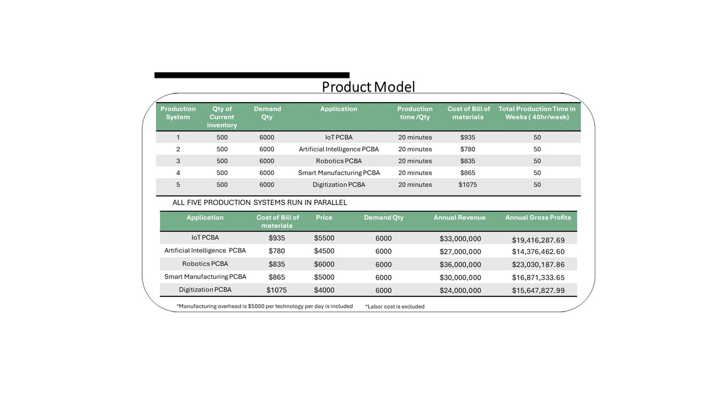

## Product Bill of Materials
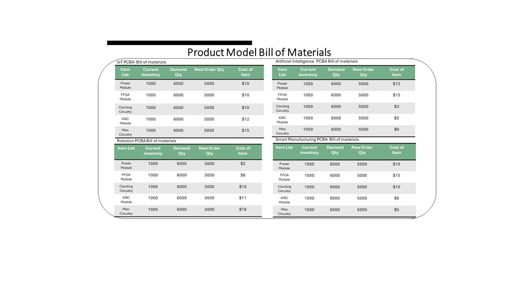

## Algorithms
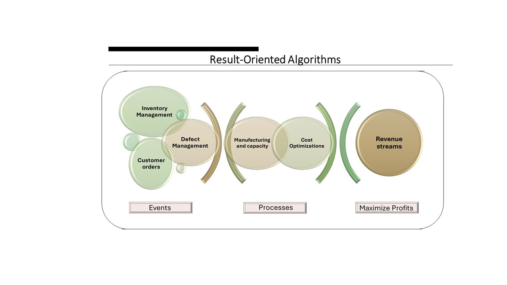

## Forecasting Model 
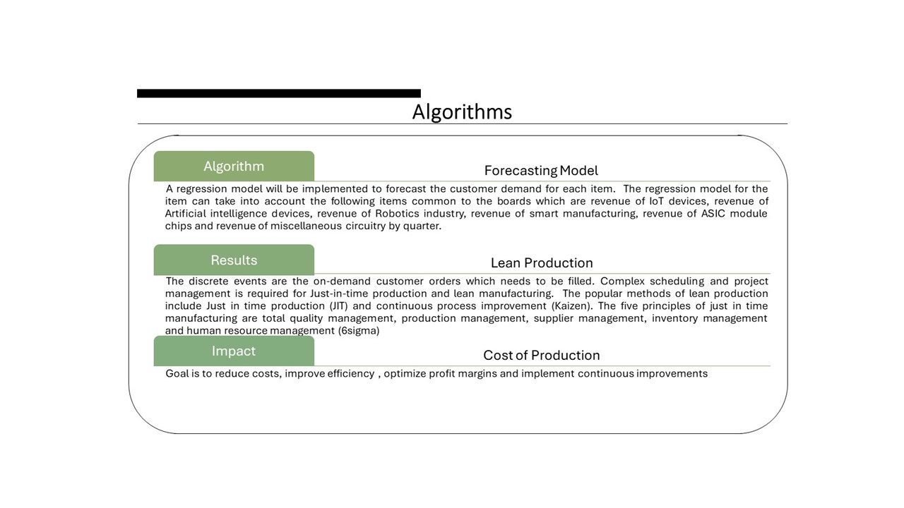

## Mfg Equipment
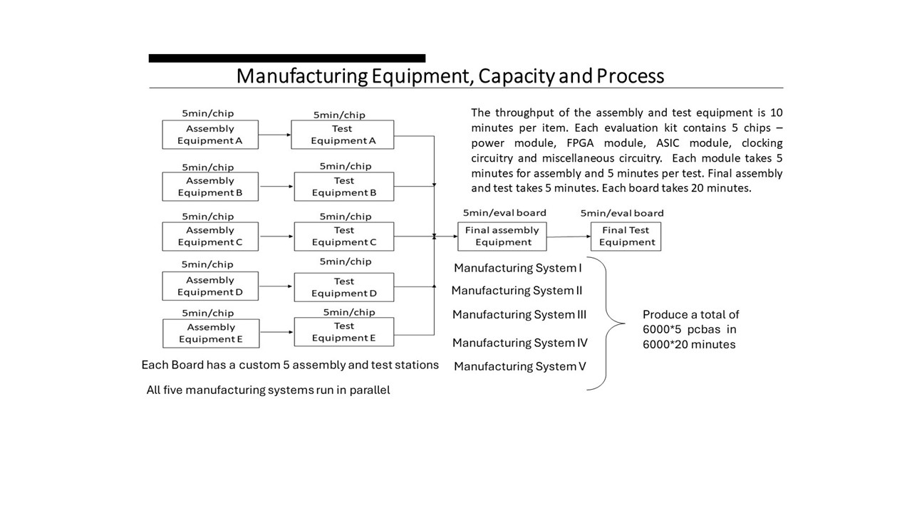

## Chart
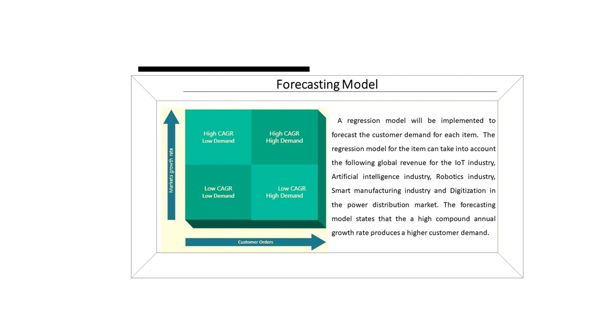

## Defect Management
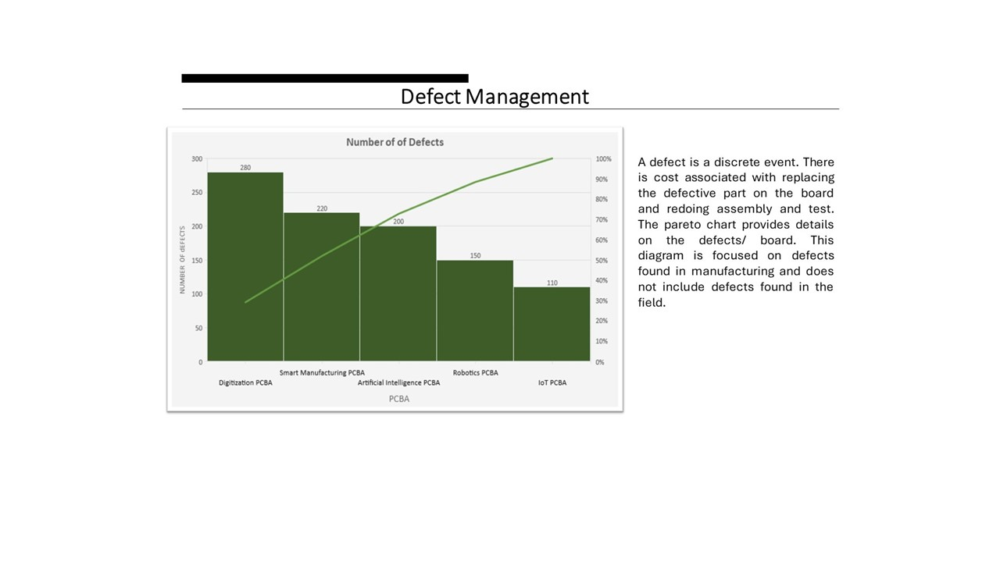

## Resource Management
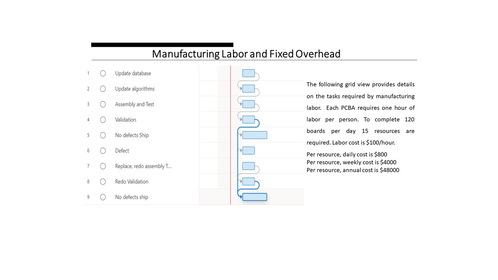

## Discrete Event Simulation 

## DEV

## Validation 
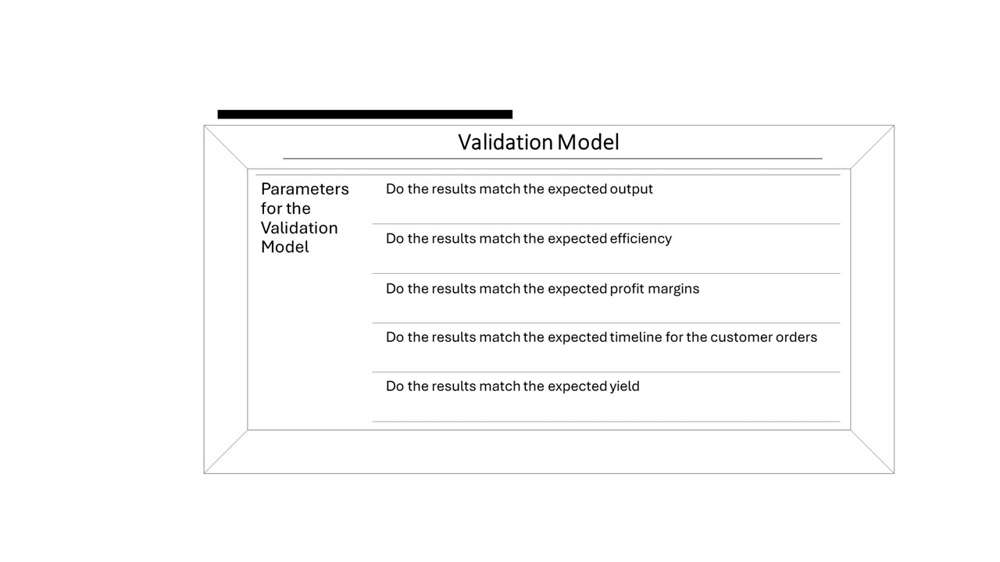

## Final Project
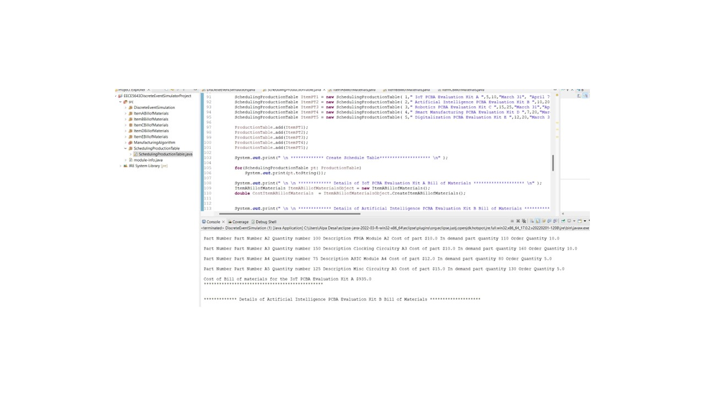

## Java
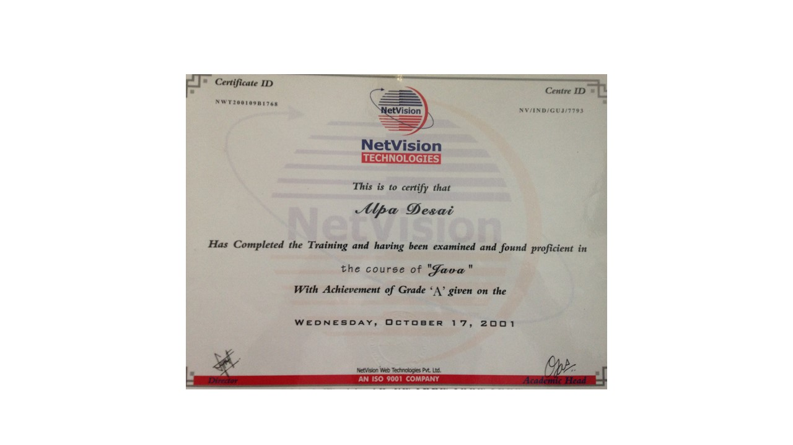

Please download the executable in https://github.com/alpaddesai/SimulationPerformance/releases/ for details.
