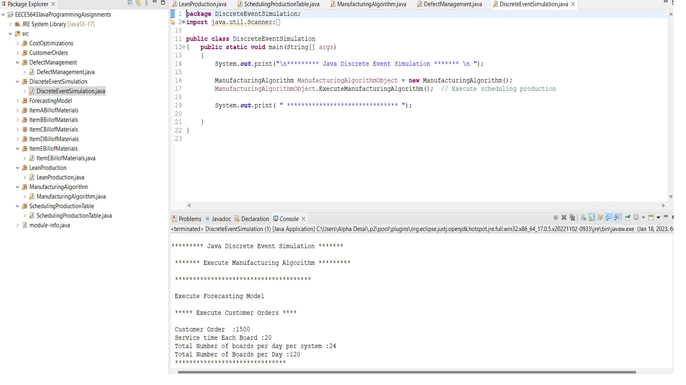
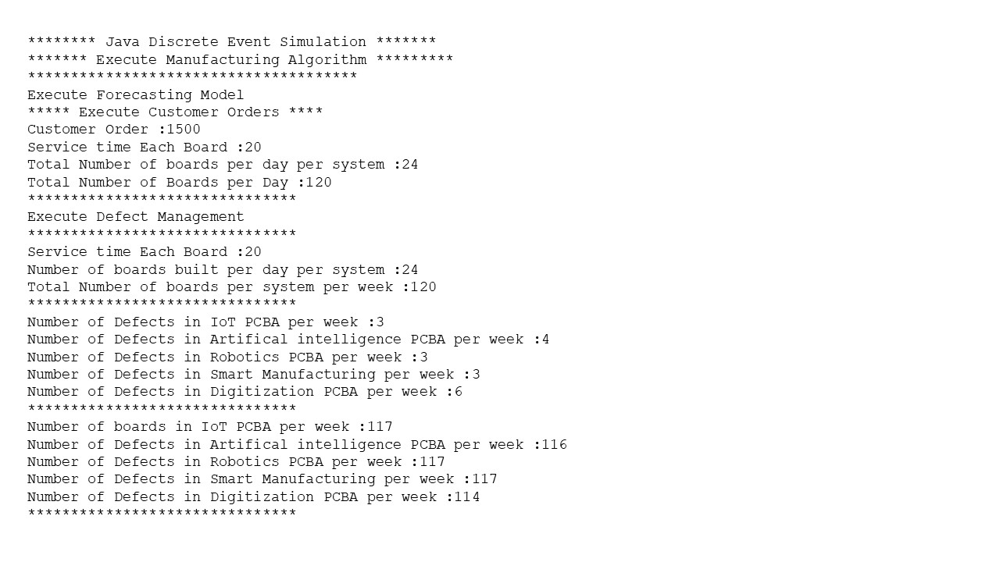
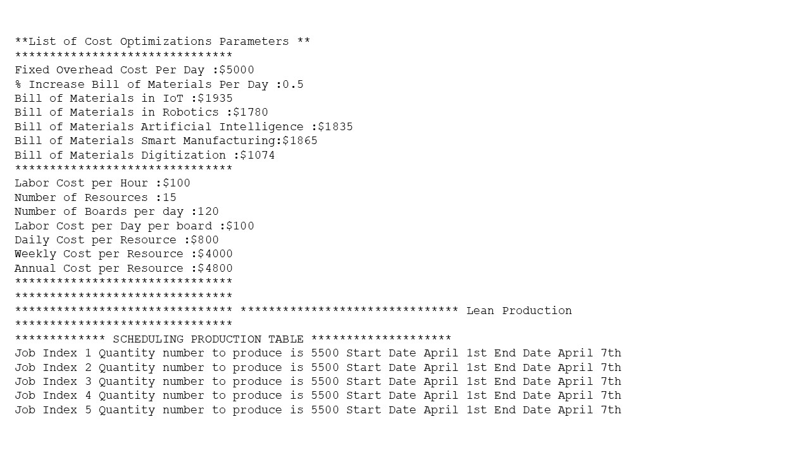
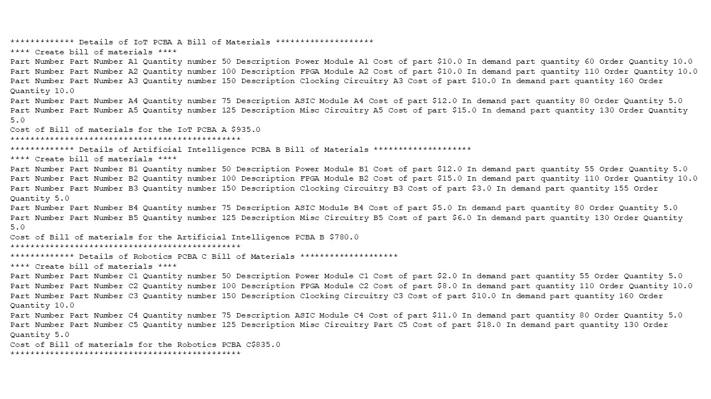
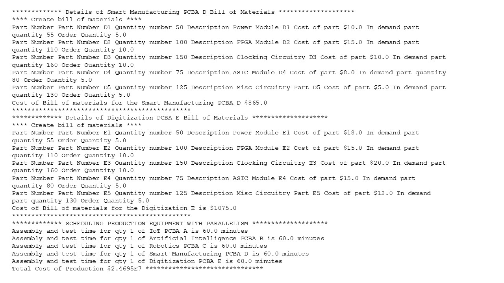

# Simulation Performance

The project provides an introduction to simulation performance and modelling. Confidential information is not displayed.Custom images created by Alpa D. Desai.

## Sales

## Profit Margins

## Revenue Streams

## Product 

## Product Bill of Materials

## Algorithms

## Forecasting Model 

## Mfg Equipment

## Chart

## Defect Management

## Resource Management

## Discrete Event Simulation 

## DEV

## Validation 

## Java Application

## Final Project

## Java Application

## Java Application

## Java Application

## Java Application

## Java Application

Please reference https://github.com/alpaddesai/ArchitecturalProductDesign
