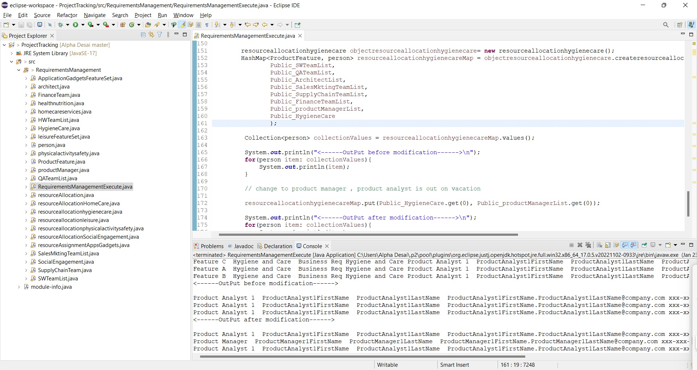

# Simulation Performance

The project provides an introduction to simulation performance and modelling. Confidential information is not displayed.Custom images created by Alpa D. Desai.

## Java project

## Java project resource allocation

Please reference https://github.com/alpaddesai/ArchitecturalProductDesign
